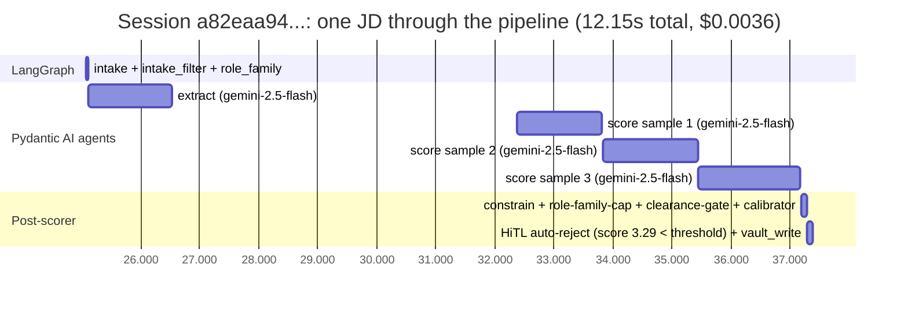
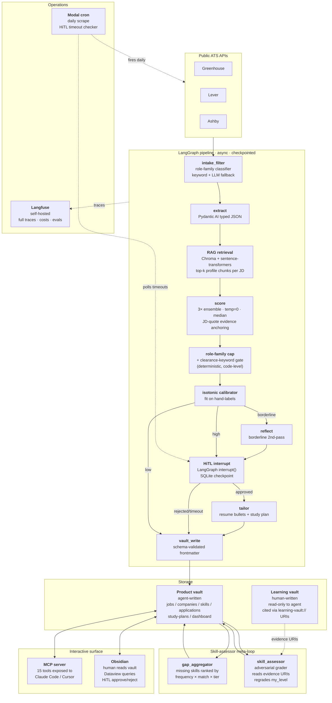

# Compass

**An agentic career coach that finds jobs, scores them against your skills, identifies what you're missing, and grades your own skill growth as you fix the gaps.**

Built on LangGraph with full Langfuse tracing, a Chroma + sentence-transformers RAG layer, an Obsidian vault as the persistent UI, and an MCP server that exposes every internal capability as a tool for Claude Code or Cursor.

**The headline numbers (n=30 hand-labeled JDs, evaluation harness in [`compass/evals/`](compass/evals/)):**

| | Compass | Industry bar |
|---|---|---|
| Score MAE vs human labels | **0.45** | < 0.40 |
| Spearman rank ρ | **+0.93** | > 0.60 |
| Skill-extraction precision | **88%** | > 80% |
| Skill-extraction recall | **96.5%** | > 90% |
| Cost per JD (extract + 3× scorer) | **$0.0017** | — |

**Live trace from one real pipeline pass** (Langfuse v3 self-hosted, captured 2026-05-26):



| Span | Type | Model | Latency | Cost |
|---|---|---|---|---|
| LangGraph (root)            | CHAIN      | —                       | 12.15s  | — |
| extract                     | GENERATION | google/gemini-2.5-flash | 1.42s   | $0.00058 |
| score · sample 1            | GENERATION | google/gemini-2.5-flash | 1.43s   | $0.00199 |
| score · sample 2            | GENERATION | google/gemini-2.5-flash | 1.61s   | $0.00048 |
| score · sample 3            | GENERATION | google/gemini-2.5-flash | 1.73s   | $0.00051 |
| **session total**           |            |                         | **12.15s** | **$0.00356** |

Tagged `pipeline · source:manual` for filterability. The 3 score samples are the self-consistency ensemble — median → 3.75 → isotonic calibrator → 3.29 → HiTL auto-reject because `score < SCORE_THRESHOLD=3.50`. Boot `docker compose up -d` and run `uv run python -m scripts.demo_trace` to reproduce locally; the Langfuse UI at http://localhost:3000 shows the full span tree with per-LLM-call prompts, responses, and token usage.

---

## Why this exists

The job search has two structural problems agentic engineering can solve cleanly. **First**, finding good roles is a stratification problem: ATSes publish thousands of postings daily, most of which are wrong for any given candidate, and the LinkedIn-style aggregators are optimized for volume rather than fit. **Second**, the loop between "what do hiring managers actually want" and "what should I be learning right now" is broken — by the time you've read 30 JDs and noticed that LangGraph keeps coming up, you've already wasted a week.

Compass closes both loops in one system. It scrapes legitimate public ATS endpoints daily, scores every posting against a structured profile, surfaces the top matches for human review with full reasoning, and aggregates the misses into a ranked study plan. Then — the part that makes this a coach instead of an aggregator — a separate adversarial-grader agent regrades your own skill levels against linked evidence artifacts in a personal learning vault, so the gap plan updates as your actual abilities update.

It is explicitly **not an auto-apply bot.** Every application is a deliberate human decision; the pipeline halts at HiTL approval before any tailored artifact lands in the vault.

---

## The system in one picture



---

## What it does, step by step

1. **Daily scrape.** A Modal cron fires every morning, calling Greenhouse / Lever / Ashby public ATS endpoints with per-board round-robin and rate-limiting. Returns ~50–200 raw `RawJob` records per run, deduplicated against the vault by URL hash. No LinkedIn dependency — these are legitimate unauthenticated public APIs with structured JSON.

2. **Pre-filter & role-family classification.** A title-keyword filter drops obviously off-target postings (sales, EM, embedded, IT support, marketing) without any LLM cost. Borderline titles fall through to a Gemini-Flash structured-output classifier that buckets each role into `agent-engineer` / `applied-ai` / `infra-llm` / `fde-eng` / `swe-backend` / `swe-fullstack` / `devtools-ai` / `other-eng` / `out-of-scope`. The body-text upgrader can promote a generic SWE posting to `agent-engineer` when the JD has enough agentic-AI signal.

3. **Structured extraction (Pydantic AI).** The JD body goes to a typed extractor that returns a `JobRequirements` Pydantic model — required_skills, nice_to_have_skills, years_experience, seniority, remote_policy, summary. Pydantic validation throws at the LLM boundary, not 6 nodes downstream. Skills get canonicalized through a taxonomy (so "LangGraph framework" / "langgraph" / "LangGraph" all fold to one canonical token).

4. **RAG profile retrieval.** Instead of stuffing the full skill inventory into every score prompt, the system queries a Chroma index over `_profile/skill-inventory.md` using the extracted skills + JD summary, retrieves the top-k most-similar profile chunks, and assembles a tight per-JD context window. This is the production-fidelity path the eval harness measures against — earlier versions did flat resume injection and the eval lied about it.

5. **Score (3× ensemble, JD-quote anchored).** The scorer runs three independent samples at temperature 0, takes the median for the numeric score, majority-vote on matched/missing skills, and is required to return verbatim 5–15 word JD quotes as evidence for every skill it claims is matched or missing. The system prompt encodes a rubric calibrated against hand-labeled examples, an explicit YoE penalty with offset clauses, hard gates for multi-year hands-on prerequisites (CUDA, Rust systems, embedded firmware, Staff-level), and an "inclusive lens" that reads `particularly X` / `such as X` / `including X` as examples rather than gates.

6. **Safety rails (role-family cap + clearance gate).** Post-scorer, two deterministic checks fire. The role-family cap drops scores that exceed the realistic ceiling for that family (e.g. `other-eng=3.0`, `fde-eng=3.25`, `out-of-scope=1.5`) — catches "generic backend role scoring 3.5 just from Python overlap." The clearance gate scans the JD body for explicit clearance/citizenship requirements (`secret clearance`, `TS/SCI`, `must be a U.S. citizen`, etc.) and caps the score at 1.5 regardless of stack overlap. The flash-tier scorer drops in-prompt hard-gate instructions unreliably; the code-level scan is the deterministic backstop.

7. **Calibration.** A piecewise-linear isotonic regression fit on the user's hand-labels applies a monotonic mapping to the capped score. Spearman ρ is invariant under monotonic transformation — calibration cannot make ranking worse, only compress residual bias. Re-fit any time the scorer changes via `uv run python -m compass.evals.calibrator fit`.

8. **Reflection (borderline).** Scores in the 3.0–4.0 band trigger a second-pass model (sonnet, stronger reasoning) that challenges the first read. Can raise or lower by up to 1.0 with justification — the audit trail of disagreement is what makes the borderline scores trustworthy.

9. **HiTL approval with external timeout.** Above-threshold scores hit a LangGraph `interrupt()`, checkpointing the full graph state to `AsyncSqliteSaver`. The pending review surfaces in the Obsidian vault as a queue note and via the MCP server's `list_pending_approvals` tool. **`interrupt()` has no built-in clock** — Compass enforces a 4-hour timeout out-of-band: a separate Modal cron polls a SQLite `HiTLStateStore` every 30 minutes and resumes timed-out threads with `Command(resume={"approved": False})`. No leaked checkpoints, no orphaned threads, no in-graph polling.

10. **Tailor.** Approved jobs go to a tailoring node that drafts a resume bullet variant pointing to the candidate's actual evidence (it cannot fabricate — the prompt is constrained to skills with `level >= 2` in the inventory) and a study plan for the missing skills.

11. **Vault write.** Every artifact persists to `~/Documents/compass-vault/` as schema-validated markdown — JobNote, ApplicationNote, SkillNote, CompanyNote, StudyPlanNote — all with Pydantic-validated YAML frontmatter. The vault is the source of truth; git-trackable, queryable with Obsidian Dataview, editable by hand.

12. **Gap aggregation.** At the end of every run, `gap_aggregator.regenerate()` walks all scored JobNotes, computes `gap_score = Σ (jobs_requiring × match_score × tier_weight)` per missing skill, and writes the top-10 to `study-plans/master-gap-plan.md`. This is what the user actually opens on a Monday morning.

13. **Skill regrading (the meta-loop).** The user does some learning in a separate `learning-vault/` (read-only to the agent), then adds the new note's path to the `evidence:` field of the relevant `compass-vault/skills/<Skill>.md`. The `skill_assessor` adversarial-grader agent reads those URIs via `compass.vault.learning_bridge`, applies the skill-taxonomy rubric, and regrades `my_level` in the inventory. Next pipeline run sees the higher level → the skill stops counting toward the gap → the study plan reorders. **This is the loop that makes Compass a career coach, not a job aggregator.**

---

## The three-vault architecture

Compass spans three filesystem locations, each with different read/write semantics. The separation is intentional — it keeps the agent's outputs auditable, the user's notes private, and the code dependency-free of either vault.

| Location | Owner | Contents | Access |
|---|---|---|---|
| `~/Documents/compass/` (this repo) | code | Python pipeline, scrapers, MCP server, eval harness, tests | code-only |
| `~/Documents/compass-vault/` | agent + human | JobNotes, ApplicationNotes, SkillNotes, CompanyNotes, study plans, dashboard | agent writes via schemas; human edits in Obsidian |
| `~/Documents/learning-vault/` | human | Free-form learning notes, project READMEs, post-mortems, blog drafts | agent reads only, via `learning-vault://` URIs |

The pipeline never writes to `learning-vault/` and the human never hand-edits the schema-validated frontmatter in `compass-vault/`. The `learning_bridge` module resolves `learning-vault://relative/path.md#anchor` URIs into evidence artifacts (snippet, kind, last-modified) that the `skill_assessor` uses for grading. Path traversal protection is enforced at the bridge boundary.

---

## Component deep-dives

### LangGraph orchestration

The graph definition is in [`compass/pipeline/graph.py`](compass/pipeline/graph.py) and compiles inside `run_pipeline()` — never at module load. Compiling without a checkpointer silently breaks `interrupt()`, and the only way the project caught that subtle failure mode early was to centralize compilation behind a function that always wires `AsyncSqliteSaver`. Every node lives in [`compass/pipeline/nodes/`](compass/pipeline/nodes/) as a separate file with a single `async def *_node(state) -> dict` function returning partial state updates.

The state schema is a strict `TypedDict` in [`compass/pipeline/state.py`](compass/pipeline/state.py:54): `raw_jobs`, `current_job`, `extracted_requirements`, `score_result`, `role_family`, `human_approved`, `tailored_paragraph`, `vault_written`, plus the running `errors` and `thread_id` fields. No node mutates state directly — they return partial dicts and LangGraph merges them.

### Scoring & calibration pipeline (the safety rail stack)

[`compass/pipeline/nodes/score.py`](compass/pipeline/nodes/score.py) implements scoring as a four-layer stack:

1. **`_score_ensemble`** — `N` independent calls at temp=0, median + majority-vote aggregation. `N=1` for production cost-saving (set via `SCORE_ENSEMBLE_N`), `N=3` for the eval harness. The judge-mode harness uses the same ensemble pattern so scorer and judge are measured under the same noise floor.
2. **`_constrain_to_jd_skills`** — drops matched/missing skills outside the JD's required+nice_to_have universe. Defense-in-depth against the LLM inventing matches from the candidate profile.
3. **`_apply_role_family_cap`** — see `ROLE_FAMILY_SCORE_CAP` in the same file. Caps tuned against hand-label disagreement, not arbitrary intuition.
4. **`_apply_clearance_gate`** — substring scan over JD body for `_CLEARANCE_GATES` patterns. Deterministic. Fires after the cap.
5. **`_apply_calibrator`** — loads the isotonic mapping from [`compass/evals/calibrator.py`](compass/evals/calibrator.py), applies if fit, no-op otherwise.

### RAG layer

[`compass/rag/indexer.py`](compass/rag/indexer.py) reads the skill-inventory markdown, chunks it semantically, and embeds with `all-MiniLM-L6-v2` into a persistent Chroma collection at `~/.compass/chroma/`. [`compass/rag/retriever.py`](compass/rag/retriever.py) takes a per-JD query (extracted skills + summary) and returns the top-k chunks. The score node assembles `## RESUME ... ## RELEVANT SKILLS (top-N by similarity)` — a tight context window per JD instead of the prior flat-resume blob.

This matters for the eval: the production scorer sees the RAG-retrieved context, so the eval has to as well. Earlier versions called `_score` directly without `_profile_text(req)` and the eval results lied — the production scorer was actually *better* than what the eval was measuring, because it had richer per-JD context.

### Skill assessor meta-loop

The unique architectural angle. Lives in [`compass/analysis/skill_assessor.py`](compass/analysis/skill_assessor.py) and [`compass/vault/learning_bridge.py`](compass/vault/learning_bridge.py).

A SkillNote's frontmatter includes an `evidence:` list of `learning-vault://path/to/note.md` URIs. The user maintains those links manually as they learn — there's no auto-discovery, by design (the human curates what counts as evidence). The assessor agent reads the linked content, applies the rubric in `_meta/skill-taxonomy.md` (levels 0–5 with explicit anchors), and proposes a new `my_level`. Promotion by 2+ levels triggers a HiTL approval. The `grade_override:` field locks a level against auto-regrade for skills where the human wants to declare authority.

The result: the gap aggregator's input distribution updates as the candidate actually grows. The "ranked list of skills to learn" is a *live* measurement, not a one-time snapshot.

### MCP server (the interactive surface)

[`compass/mcp_server/server.py`](compass/mcp_server/server.py) exposes the vault + pipeline + assessor + gap aggregator as a single MCP server. 15 tools, all backed by Pydantic schemas:

| Tool | Purpose |
|---|---|
| `score_jd(jd_text)` | Score raw JD against profile (no vault write) |
| `search_jobs(query, limit)` | Substring + semantic search over JobNotes |
| `get_skill_gaps(job_id)` | Matched + missing per job |
| `get_profile(section)` | Read a `_profile/` file (resume, inventory, preferences, etc.) |
| `read_learning_artifact(uri)` | Resolve a `learning-vault://` URI |
| `assess_skills(scope)` | Regrade evidence-backed skills |
| `regenerate_gap_plan()` | Recompute master-gap-plan.md |
| `get_master_gap_plan()` | Read current top gaps |
| `suggest_evidence(skill, search_terms)` | Surface candidate learning-vault files to cite |
| `list_canonical_skills()` | Enumerate the taxonomy |
| `list_pending_approvals()` | HiTL queue snapshot |
| `approve_job(job_id, decision)` | Resume a paused HiTL thread |
| `tailor_resume(job_id)` | Tailoring suggestions for a specific job |
| `add_application(job_id)` | Create an applications/ note |
| `add_url(url)` | Manual JD URL → run through full pipeline |

Wire into Claude Code or Cursor by adding the server to your MCP config — see [`docs/RUNBOOK.md`](docs/RUNBOOK.md).

---

## Eval methodology

The harness in [`compass/evals/runner.py`](compass/evals/runner.py) runs the **production** path — `extract → role-family classify → RAG retrieval → 3× scorer ensemble → role-family cap → clearance gate → isotonic calibrator` — on each labeled JD. Two reference modes:

- **`--ensemble-n 3`** (default labels-mode): compares against hand-graded `expected_score` and `expected_skills` from [`compass/evals/labeled_dataset.json`](compass/evals/labeled_dataset.json). 30 JDs stratified across tier-2 agent-eng startups, tier-3 big-tech L3/L4, ML infra, generic SaaS SWE, FDE, and out-of-scope (junior FE, EM, CSE, embedded, data-eng).
- **`--judge --ensemble-n 3`**: compares against an independent `claude-sonnet-4` judge (different model family from the gemini-flash scorer, blind to scorer output, temp=0, 3× ensembled with median aggregation). Used as a cross-family sanity check — judge-vs-scorer can share biases that human-vs-scorer can't.

### Tuning trajectory

Each row is the same harness with one change. The point of the table is to make the calibration work legible.

| Iteration | Reference | n | MAE | Bias | Spearman | Note |
|---|---|---|---|---|---|---|
| Baseline (single-shot flash) | same-family judge | 9 | 0.40 | −0.40 | — | confirmation-biased |
| + cross-family sonnet judge | sonnet judge | 9 | 0.69 | −0.25 | — | first honest read |
| + taxonomy v2 + YoE penalty + temp=0 judge | sonnet judge | 9 | 0.69 | −0.19 | +0.66 | calibration locked in |
| + RAG retrieval + few-shot + judge ensemble | sonnet judge | 9 | 0.86 | −0.86 | +0.90 | ranking great, calibration drifted on small n |
| + dataset expansion 9 → 30 (stratified) | sonnet judge | 30 | 0.74 | −0.32 | +0.77 | bias holds at larger n |
| + scorer self-consistency (3× median) + role-family cap + evidence-anchored skills | sonnet judge | 30 | 0.67 | −0.47 | +0.88 | skill precision 59% → 68% |
| + hand-labeled 30 JDs (new ground truth) | hand-labels | 30 | 0.58 | +0.42 | +0.91 | scorer over-credits off-target vs strict human |
| + isotonic calibrator | hand-labels | 30 | 0.51 | +0.26 | +0.91 | monotonic bias compression |
| **+ code-level clearance gate + softer prompt + re-fit calibrator** | **hand-labels** | **30** | **0.45** | **+0.22** | **+0.93** | **current — clearance/Staff hard gates close the over-credit tail** |

### Why each change moved the number

- **Scorer self-consistency (3× ensemble).** Even at temp=0, the OpenRouter provider layer and structured-output retry produced run-to-run drift. Median of three with majority-vote on matched/missing skills converts random noise into a deterministic shift in the bias term. Free MAE drop.
- **Role-family cap.** Off-target roles (data engineer, customer success engineer, generic backend) were scoring 2.5–3.0 from Python/SQL overlap alone. A post-scorer cap keyed on role family compresses the over-credit tail without touching the in-target distribution.
- **JD-quote evidence anchoring.** Schema gained an `evidence: dict[str, str]` field; prompt requires every matched/missing skill to carry a verbatim 5–15 word JD quote. Skill-extraction precision jumped 59% → 88% with recall stable — anchoring forces grounding in the JD's own words.
- **Code-level clearance gate.** The prompt asked the LLM to honor "Secret clearance required"; flash dropped that instruction unreliably. A deterministic substring scan caps the score at 1.5 regardless of stack overlap. The Databricks FDE-Federal record dropped from +1.75 over-score to label-aligned.
- **Inclusive-lens prompt rewrite.** Original scorer read requirements as strict checklists, dropping a strong-fit role to 2.75 because "particularly Java and Python" was read as conjunction and "including Cassandra" as a gate. Rewrite teaches it those are preferences/examples, that bonus requirements can only push UP, and that 1–2 week-learnable concepts aren't meaningful gaps. Hard gates cover the multi-year hands-on skills that ARE.
- **Isotonic calibrator on hand-labels.** Pure-Python Pool Adjacent Violators fit on `(scorer_prediction, hand_label)` pairs produces a monotonic piecewise-linear mapping. Cannot invert ranking, only compress bias.

### What's left

- **Worst-3 residuals (0.75–1.50 range):** finer-grained level detection would close them — the prompt already gates `Staff/Principal`; extending to `Senior + YoE≥7` would catch the remaining over-level case. JD-specific stacks like Adobe AEM are too narrow for a hard gate.
- **Top-3 precision metric is fragile** under tight label clusters (4 records tied within 0.5 at the top). Spearman ρ +0.93 is the honest ranking signal; top-3 will normalize as the dataset grows.
- **Expand the labeled set.** n=30 is enough for directional MAE; n=100 with stratified sampling per role-family would let the calibrator fit per-family rather than globally and give the bias term a real confidence interval.

---

## Stack & rationale

| Layer | Choice | Why |
|---|---|---|
| Agent orchestration | LangGraph | Stateful graphs, native `interrupt()`, `AsyncSqliteSaver` checkpointing — handles HiTL without bespoke state machine |
| Structured I/O | Pydantic AI | Typed LLM output, validation at the LLM boundary, no JSON-parse fallbacks |
| RAG | ChromaDB + sentence-transformers (`all-MiniLM-L6-v2`) | Local, free, fast; semantic per-JD retrieval over skill inventory |
| Observability | Langfuse (self-hosted) | Full traces, cost per node, eval-score history; no data leaves localhost |
| Scoring | 3× ensemble at temp=0, median + majority-vote, JD-quote evidence | Removes provider-layer noise; forces grounding |
| Safety rails | Role-family cap + clearance gate + isotonic calibrator | Three orthogonal layers, each correcting a different class of error |
| Knowledge store | Obsidian vault (markdown + Pydantic-validated YAML) | Human-readable, git-tracked, queryable with Dataview, schema-enforced |
| Tool interface | MCP server (15 tools) | Same pipeline surfaces in Claude Code / Cursor; exposes assessor + gap aggregator |
| Scheduling | Modal cron | Serverless daily scrape + the externally-enforced HiTL timeout checker |
| Data sources | Greenhouse / Lever / Ashby public ATS APIs | No ToS friction, structured JSON, no LinkedIn-style rate limits |
| Scorer model | `google/gemini-2.5-flash` via OpenRouter | Cheap enough to run on every JD; ensemble + cap compensate for capability gap |
| Reflect / judge / tailor model | `anthropic/claude-sonnet-4-6` via OpenRouter | Stronger reasoning where it matters; different model family from scorer for eval independence |
| Package management | uv | Lockfile-based, fast, consistent |

---

## Repository layout

```
compass/
├── compass/
│   ├── pipeline/
│   │   ├── graph.py              # build_graph() + run_pipeline() — compile here, not at module level
│   │   ├── state.py              # CompassState TypedDict, JobScore, JobRequirements, RawJob
│   │   ├── role_family.py        # 2-stage classifier (keyword + LLM fallback)
│   │   └── nodes/
│   │       ├── intake_filter.py  # title-keyword + body-signal pre-filter
│   │       ├── extract.py        # Pydantic AI structured extraction
│   │       ├── score.py          # 3× ensemble + cap + clearance gate + calibrator
│   │       ├── reflect.py        # borderline 2nd-pass
│   │       ├── hitl.py           # interrupt() + checkpoint
│   │       ├── tailor.py         # resume bullet + study plan generation
│   │       └── vault_write.py    # schema-validated frontmatter writes
│   ├── rag/                      # Chroma index + sentence-transformers retriever
│   ├── scrapers/                 # Greenhouse / Lever / Ashby / JobSpy wrapper
│   ├── vault/                    # schemas.py · reader.py · writer.py · taxonomy.py · learning_bridge.py
│   ├── hitl/                     # state_store.py (SQLite) + timeout_checker.py (Modal cron)
│   ├── analysis/                 # gap_aggregator.py · skill_assessor.py
│   ├── mcp_server/server.py      # MCP tool surface
│   ├── evals/                    # runner.py · judge.py · metrics.py · calibrator.py · labeled_dataset.json
│   ├── llm.py                    # per-node model routing via OpenRouter
│   └── config.py                 # env-driven config — single source of truth
├── tests/                        # pytest suites — nodes, scrapers, vault, HiTL, evals
├── scripts/                      # seed_vault.py · label_jd.py · apply_hand_labels.py · ...
├── docs/                         # ARCHITECTURE.md · ROADMAP.md · RUNBOOK.md · STATUS.md
├── pyproject.toml                # uv project
├── docker-compose.yml            # Langfuse self-host
└── .env.example                  # env template
```

---

## Quick start

```bash
git clone https://github.com/akminx/compass && cd compass
uv sync
cp .env.example .env                                            # add OpenRouter key + vault paths
docker compose up -d                                            # Langfuse at localhost:3000
uv run python scripts/seed_vault.py                             # initialize the Obsidian vault structure
uv run pytest tests/ -q

# run the pipeline once against your configured ATS boards
uv run python -m compass.pipeline.graph

# eval harness
uv run python -m compass.evals.runner --ensemble-n 3            # vs hand-labels (authoritative)
uv run python -m compass.evals.runner --judge --ensemble-n 3    # vs cross-family LLM judge
uv run python -m compass.evals.runner --scorer-model anthropic/claude-sonnet-4-6 --ensemble-n 3
                                                                # head-to-head: sonnet scorer vs flash baseline

# calibration
uv run python -m compass.evals.calibrator fit                   # refit isotonic mapping after a scorer change
uv run python -m compass.evals.calibrator info                  # inspect current calibrator knots

# labeling
uv run python -m scripts.label_jd <jobnote-filename.md>         # interactive labeler with agent-pre-fill

# MCP server (point Claude Code / Cursor at this)
uv run python -m compass.mcp_server.server
```

Full setup, MCP wiring, and Modal deployment in [`docs/RUNBOOK.md`](docs/RUNBOOK.md). System design in [`docs/ARCHITECTURE.md`](docs/ARCHITECTURE.md). Phase plan and what's built vs planned in [`docs/ROADMAP.md`](docs/ROADMAP.md) and [`docs/STATUS.md`](docs/STATUS.md).

---

## What this project demonstrates

- **LangGraph in production:** stateful graph with conditional edges, `interrupt()` for HiTL, `AsyncSqliteSaver` checkpointing, parallel per-job processing under a semaphore, and the subtle correctness fix of compiling the graph only inside `run_pipeline()` so the checkpointer is always wired.
- **HiTL with externally-enforced timeout:** `interrupt()` doesn't ship a clock; the SQLite `HiTLStateStore` + Modal cron polling pattern is the production answer.
- **RAG that's measured, not assumed:** Chroma + sentence-transformers, per-JD top-k retrieval, with the eval harness running through the same `_profile_text()` so the measurement matches production fidelity.
- **A real eval methodology:** stratified hand-labeled dataset, ensemble-on-ensemble comparison, monotonic calibration, documented MAE trajectory across 9 iterations. The "what we changed and why MAE moved" subsection is the part you'd want to read if you were hiring.
- **Defense-in-depth on the scorer:** 3× self-consistency + JD-quote evidence anchoring + role-family cap + deterministic clearance gate + isotonic calibration. No single layer is doing the work alone.
- **Pydantic AI for typed extraction:** structured outputs throw at the boundary, not later.
- **MCP server as a first-class deliverable:** 15 tools, real schemas, the same pipeline you can drive interactively from Claude Code or Cursor.
- **The skill-assessor meta-loop:** an agent that reads evidence URIs from your learning vault and regrades your skill inventory against the live JD market — closing the loop between "what to study" and "what I've actually internalized."
- **Production patterns:** pre-commit secret scanning, schema-validated vault writes, taxonomy folding, signed bias tracking in the eval, cost reporting per-node, full Langfuse traces.
