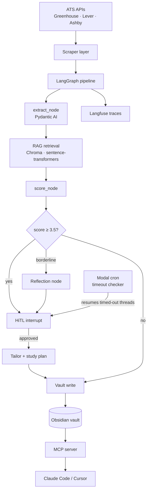

# Compass — Agentic Career Coach

> An agentic job search system that finds roles, scores them against your profile, identifies skill gaps, and generates study plans. Built with LangGraph, Pydantic AI, and Langfuse. Uses Obsidian as a persistent knowledge vault.

**This system found the job I'm interviewing for.**

---

## What it does

1. **Discovers** job postings from public ATS APIs (Greenhouse, Lever, Ashby) on a daily schedule
2. **Scores** each role against your skill inventory using an LLM-powered evaluation pipeline
3. **Identifies gaps** — which required skills you're missing, ranked by frequency across all roles
4. **Generates study plans** — prioritized learning roadmaps written directly into your vault
5. **Tailors** resume suggestions for high-scoring roles
6. Keeps you in the loop with **human-in-the-loop approval** before any application action

Not an auto-apply bot. Every application is a deliberate human decision.

---

## Architecture



[→ Full architecture doc](docs/ARCHITECTURE.md)

---

## Observability

Every pipeline run is fully traced in Langfuse.

**[View a live trace →]()**  ← _add your Langfuse public trace URL here_

Tracks: cost per run · tokens per node · match score distribution · eval precision over time

---

## Eval results

_Add your precision/cost chart here once the eval harness is running._

---

## Quick start

```bash
git clone https://github.com/akminx/compass && cd compass
uv sync
cp .env.example .env        # fill in your OpenRouter key + vault path
docker compose up -d        # start Langfuse at localhost:3000
uv run python scripts/seed_vault.py
uv run pytest tests/ -q
uv run python -m compass.pipeline.graph
```

See [docs/RUNBOOK.md](docs/RUNBOOK.md) for full setup.

---

## Stack

| Layer | Choice | Why |
|---|---|---|
| Agent orchestration | LangGraph | Stateful graphs, HiTL interrupts, time-travel debugging |
| Structured I/O | Pydantic AI | Typed LLM extraction — no silent schema failures |
| RAG / vector store | ChromaDB + sentence-transformers | Semantic skill retrieval for score_node context |
| Observability | Langfuse (self-hosted) | Full traces, cost tracking, eval scoring |
| Knowledge store | Obsidian vault | Human-readable, git-trackable, queryable with Dataview |
| Tool interface | MCP server | Exposes pipeline to Claude Code / Cursor |
| Scheduling | Modal cron | Serverless daily scan + HiTL timeout checker |
| Data sources | Greenhouse · Lever · Ashby public APIs | No ToS violations, structured JSON |

---

## What I learned / what I'd do differently

_Fill this in as you build. Interviewers read this section._

---

## Project status

See [docs/STATUS.md](docs/STATUS.md) for what's built vs planned.
