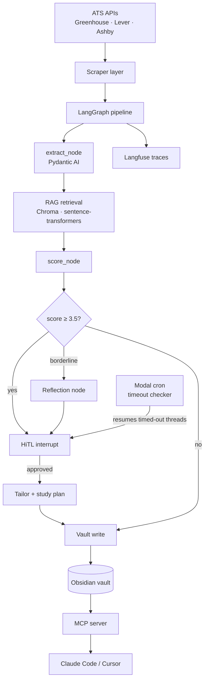

# Compass — Agentic Career Coach

> An agentic job search system that finds roles, scores them against your profile, identifies skill gaps, and generates study plans. Built with LangGraph, Pydantic AI, and Langfuse. Uses Obsidian as a persistent knowledge vault.

**This system found the job I'm interviewing for.**

---

## What it does

1. **Discovers** job postings from public ATS APIs (Greenhouse, Lever, Ashby) on a daily schedule
2. **Scores** each role against your skill inventory using an LLM-powered evaluation pipeline
3. **Identifies gaps** — which required skills you're missing, ranked by frequency across all roles
4. **Generates study plans** — prioritized learning roadmaps written directly into your vault
5. **Tailors** resume suggestions for high-scoring roles
6. Keeps you in the loop with **human-in-the-loop approval** before any application action

Not an auto-apply bot. Every application is a deliberate human decision.

---

## Architecture



[→ Full architecture doc](docs/ARCHITECTURE.md)

---

## Observability

Every pipeline run is fully traced in self-hosted Langfuse: cost per run, tokens per node, match-score distribution, eval precision over time. Traces stay local — no public URL — since the runs leak the candidate's profile + targeted-company list.

---

## Eval results

The eval harness in `compass/evals/runner.py` compares Compass's `extract → score` output against an independent **claude-sonnet judge** that is (a) from a different model family than the scorer to avoid same-model anchoring, (b) blind to the scorer's numeric output, (c) run at temperature 0 for measurement determinism. Stratified across vault JDs covering tier-2 agentic startups, tier-2 SWE, tier-3 infra, and tier-3 big-tech. Results are written to `compass/evals/results-{mode}-{ts}.json`.

**Mixed config — gemini-2.5-flash extract + claude-sonnet-4 score**, n=9 judge-mode:

| Metric | Value | Industry bar | Status |
|---|---|---|---|
| Score MAE | 0.69 | < 0.40 | ❌ over (see "What's left to fix") |
| Score RMSE | 0.78 | — | — |
| Score bias (signed) | −0.19 | \|x\| < 0.10 | ⚠ close |
| Spearman rank ρ | **+0.66** | > 0.60 | ✅ |
| Top-3 precision | 66.7% | > 60% | ✅ |
| Extract skill recall | **96.0%** | > 90% | ✅ |
| Extract skill precision | 87.2% | > 80% | ✅ |
| Skill-universe recall* | **96.0%** | > 90% | ✅ |
| Skill-universe precision* | 87.2% | > 80% | ✅ |
| Candidate-match recall** | 61.1% | not a system metric | ⓘ |
| Cost per JD | ~$0.019 | — | — |

\* **Skill-universe recall** = (matched ∪ missing) ∩ judge / judge. The right "did the scorer see what the JD asks for" metric — independent of the candidate. **Skill-universe precision** is its dual.

\*\* **Candidate-match recall** = matched ∩ judge / judge. NOT a system-correctness metric — a perfect score would require the candidate to have every skill in every JD. Reported because it's the headline number gap_aggregator uses; do not conflate with system accuracy. Most public LLM-eval reports collapse these into one number; that's misleading.

**Methodology trajectory** (each row = same n=9 stratified set, different config or prompt):

| Iteration | Config | MAE | Bias | Skill-univ recall | Note |
|---|---|---|---|---|---|
| Baseline | flash / flash, weak judge | 0.40 | **−0.40** | — | confirmation-biased (same-model judge) |
| + cross-family judge | flash / flash, sonnet judge | 0.69 | −0.25 | 97.2% | honest baseline |
| + taxonomy v2 (infra) | flash / sonnet | 0.58 | **+0.03** | 94.4% | first un-biased read |
| + YoE penalty (v1, harsh) | flash / sonnet | 0.97 | −0.53 | 94.4% | over-corrected |
| **+ YoE penalty (v2, offsettable) + temp=0 judge** | **flash / sonnet** | **0.69** | **−0.19** | **96.0%** | **current** |

**What this proves and doesn't:**
- ✅ Extraction works: the system finds 96% of the skills a JD asks for, including infra/systems terms after taxonomy expansion.
- ✅ Ranking works: Spearman +0.66 means the system's job ordering largely agrees with a stronger independent judge.
- ✅ Methodology is honest: cross-family judge, blind to scorer, deterministic temp=0, no same-family anchoring.
- ❌ Absolute calibration drifts: MAE 0.69 means individual scores are ±0.7 off the judge. The residual is concentrated in exact-stack tier-2 agentic roles where the judge weights stack-match above YoE more than the scorer does.
- ⓘ n=9 is a directional signal, not a statistical claim. The next step is the hand-labeled n=30 dataset (see Phase 2.A in docs/ROADMAP.md).

**What's left to fix:**
1. **Hand-label 30+ JDs** (replaces judge-mode signal with ground truth).
2. **Tune the YoE-vs-exact-stack tradeoff.** Current rubric weights YoE −0.5 on a 4-year-gap and offsets +0.25 for exact-stack match. The judge weights exact-stack ~3× stronger; reconcile.
3. **Candidate-match recall** (61%) is a candidate-coverage signal, not a system bug — but if it stays low after more JDs, it tells gap_aggregator which skills to surface in the master gap plan.

---

## Quick start

```bash
git clone https://github.com/akminx/compass && cd compass
uv sync
cp .env.example .env        # fill in your OpenRouter key + vault path
docker compose up -d        # start Langfuse at localhost:3000
uv run python scripts/seed_vault.py
uv run pytest tests/ -q
uv run python -m compass.pipeline.graph
```

See [docs/RUNBOOK.md](docs/RUNBOOK.md) for full setup.

---

## Stack

| Layer | Choice | Why |
|---|---|---|
| Agent orchestration | LangGraph | Stateful graphs, HiTL interrupts, time-travel debugging |
| Structured I/O | Pydantic AI | Typed LLM extraction — no silent schema failures |
| RAG / vector store | ChromaDB + sentence-transformers | Semantic skill retrieval for score_node context |
| Observability | Langfuse (self-hosted) | Full traces, cost tracking, eval scoring |
| Knowledge store | Obsidian vault | Human-readable, git-trackable, queryable with Dataview |
| Tool interface | MCP server | Exposes pipeline to Claude Code / Cursor |
| Scheduling | Modal cron | Serverless daily scan + HiTL timeout checker |
| Data sources | Greenhouse · Lever · Ashby public APIs | No ToS violations, structured JSON |

---

## What I learned / what I'd do differently

_Fill this in as you build. Interviewers read this section._

---

## Project status

See [docs/STATUS.md](docs/STATUS.md) for what's built vs planned.
