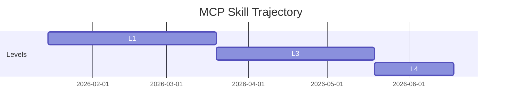
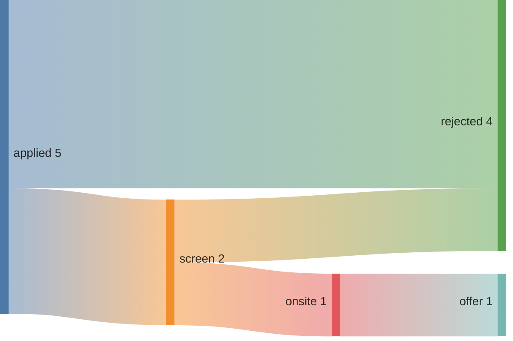
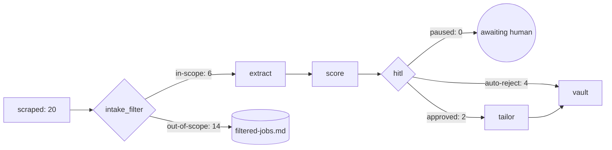

# Obsidian Leverage — Part 2: Use-Case Oriented Ideas

> Part 1 (`OBSIDIAN_LEVERAGE.md`) covered the foundational graph/link layer (P1-P8). This doc goes deeper — organized around the actual problems you face during a tier-2 agentic-AI job search, with Obsidian features mapped to each. Pick what helps; ignore what doesn't.

---

## Problem 1: "What should I study TODAY?"

You have a master gap plan, but it's a ranked list. You need a daily-flow recommendation that connects "what I worked on yesterday" with "what to do today."

### Idea 1.1: Daily note → skill evidence auto-pipeline

You already have `learning-vault/daily/YYYY-MM-DD.md`. Establish a convention: when you log work in a daily note, link the skill. Example:

```markdown
# 2026-05-19

Today I built the Chroma RAG layer for Compass. Decided to use cosine
distance instead of L2 after testing both. Empirically verified the
`with_msgpack_allowlist` API is a no-op when the default is True.

Worked on: [[LangGraph]] [[Chroma]] [[RAG]] [[MCP_server_authoring]]
```

**Automation:** a tiny script `compass/rag/sync_daily_evidence.py` scans `learning-vault/daily/*.md` for `[[SkillName]]` patterns and auto-appends the daily-note URI to each referenced SkillNote's `evidence:` list. Run weekly via Modal cron (Phase 1.B.3).

**What you get:** daily writing → skill evidence URIs grow → next `assess_skills` run reflects the work. Closes the "build → write → regrade" loop the spec promised.

**Effort:** ~30 min for the script. Behavioral cost: you have to actually write daily notes.

### Idea 1.2: Heatmap-calendar plugin (community)

Install `obsidian-heatmap-calendar`. Render a GitHub-contributions-style grid showing daily skill activity. Days with skills worked on glow green; idle days are gray.

**Where:** a callout block on `dashboard.md`:

````markdown
```heatmap-calendar
year: 2026
colors: greens
entries:
  # dataview-derived count of distinct skills worked on per day
```
````

**What you get:** visual reinforcement loop. Bad week → see the gray patch → fix it. Good streak → see momentum.

### Idea 1.3: "Today's study target" — a dynamic dashboard widget

Dataview block on `dashboard.md` that computes: "the top-3 gaps from master-gap-plan, intersected with skills the user hasn't touched in the last 7 days."

````markdown
```dataview
TABLE WITHOUT ID
  file.link AS Skill,
  gap_score AS Gap,
  last_assessed AS "Last touched"
FROM "skills"
WHERE gap_score > 0.5
  AND (last_assessed = null OR date(last_assessed) < date(today) - dur(7d))
SORT gap_score DESC
LIMIT 3
```
````

**What you get:** opens dashboard → sees "your top neglected high-gap skills are X, Y, Z." No decision fatigue.

---

## Problem 2: "I have an interview Friday — what do I prepare?"

You get a recruiter screen for AgentCo Agent Engineer. You need to know which of your skills + stories to lead with, which gaps to acknowledge, which to deflect.

### Idea 2.1: STAR story bank linked to skills

Create `compass-vault/interview-prep/stories/*.md` — one note per STAR story (Situation, Task, Action, Result). Each story links to the skills it demonstrates:

```markdown
# production MCP Servers — 4-server architecture

## Situation
a prior employer needed natural-language access to their internal observability stack...

## Task
Build MCP servers for [[Splunk]], [[Grafana]], [[Datadog]], [[ServiceNow]]...

## Action
Designed a 4-server pattern with shared auth + tool registry. Used
[[FastMCP]] and [[Pydantic]] for typed surfaces. [[Python]] backend...

## Result
Adopted across the SRE team. Reduced incident triage time by ~40%.
Talk: [[talks/internal-mcp-talk]]

## Skills demonstrated
[[MCP]] [[MCP_server_authoring]] [[Python]] [[Multi-Agent]] [[Production_Concerns]]
```

**What you get:** when a JobNote requires `[[MCP]]`, Obsidian's backlinks panel on the MCP SkillNote shows every story you have for it. Or vice versa — open the JobNote, see which skills are required, click each one to find your relevant stories.

### Idea 2.2: Interview-prep playbook auto-assembled per JobNote

A Dataview query block embedded in EVERY JobNote (via writer template):

````markdown
## Stories I have for this role's requirements

```dataview
LIST
FROM "interview-prep/stories"
WHERE any(skills_demonstrated, (s) => contains(this.skills_required, s))
SORT file.name DESC
```

## Skill gaps to acknowledge

`= filter(this.skills_required, (s) => link("skills/" + s).my_level < 2)`
````

**What you get:** open any JobNote → instantly see which stories to lead with + which weaknesses to prepare a response for. Zero manual lookup.

### Idea 2.3: Post-interview retro that closes the loop

After every interview, a retro note in `learning-vault/interview-prep/postmortems/`:

```markdown
# 2026-05-25 — AgentCo Agent Engineer screen

Result: passed → onsite

## What worked
- Led with production MCP story for the agent-orchestration question
- "Show me a hard debugging session" → described the C1 audit-trail
  divergence we fixed in Compass 1.B.1

## What missed
- They asked about [[Evals]] specifically — I conceptually know it but
  no shipped artifact. Acknowledged as a current gap.
- [[Modal]] cron experience — only theoretical right now (1.B.3 work
  hasn't shipped). Pivoted to general k8s cron experience.

## Linked
[[applications/2026-05-19-agentco-Software_Engineer_Agent_Architecture]]
```

**Automation hook:** add `learning-vault://interview-prep/postmortems/*.md` to every relevant SkillNote's `evidence:` on save. Skills you successfully described in interviews accumulate proof. Skills that got flagged as gaps move up the study priority.

### Idea 2.4: "Difficult question bank" tagged by skill

A folder `interview-prep/questions/` with notes per question type. Tag each with the skills it tests:

```markdown
# How would you build an agentic system for X?

Tags: #q/system-design #skill/agent-frameworks #skill/multi-agent

## My current answer outline
1. Clarify constraints: latency, error tolerance, observability
2. Sketch [[LangGraph]] state machine + checkpointing
3. Tool layer via [[MCP]]
4. Eval harness via [[LangSmith]] or [[Langfuse]]
```

**What you get:** before any interview, search the tag pane for `#skill/agent-frameworks` → see every question you've prepped + your current answer. Refine answers over time as artifacts grow.

---

## Problem 3: "I keep missing good jobs in the noise"

The pipeline scrapes ~20 jobs/day. You can't scan all of them. The dashboard's "Apply now (top 5)" panel helps but you're missing context.

### Idea 3.1: Quick-capture inbox

`compass-vault/_inbox/` folder. When you see a JD on LinkedIn / X / Slack, paste it into `_inbox/2026-05-19-some-company.md`. The pipeline gains an `inbox_node` (or `_scrape_all` is extended) that picks up `_inbox/*.md` files and runs them through the normal pipeline.

**What you get:** zero-friction capture. Don't lose interesting jobs to "I'll save the link in a Slack DM and forget."

**Effort:** ~1 hour to add an inbox scraper. Same RawJob shape as the ATS scrapers; just a different source.

### Idea 3.2: Custom "this week's best fits" Dataview

The dashboard has "Apply now (top 5)" but it's score-sorted from all-time. Add a "best fit found this week" panel:

````markdown
```dataview
TABLE WITHOUT ID
  file.link AS Job,
  company,
  match_score AS Score,
  tier
FROM "jobs"
WHERE date_found >= date(today) - dur(7d)
  AND match_score >= 3.0
  AND tier != "skip"
SORT match_score DESC
LIMIT 10
```
````

**What you get:** Monday morning, open dashboard → "10 fresh roles worth a look this week."

### Idea 3.3: Anti-pattern note → intake_filter feedback

You keep getting AE/PM/management roles through the filter (or marginally past it). Maintain a personal anti-pattern note:

```markdown
# _profile/anti-patterns.md

## Roles I will NEVER apply to (auto-reject)
- Management track (Engineering Manager, Lead, Director, VP)
- Pre-sales / Solutions Engineer / Sales Engineer
- Customer Success / Solutions Architect (sales-track)
- Pure DevRel / Developer Advocate
- Internships

## Roles I'm UNDECIDED on (route to manual review)
- Research-only (no shipped systems): scoring lower than 3.0 is fine
- Customer-facing FDE roles: prefer SF/NYC, decline remote-only
```

`intake_filter._llm_classify` reads this note as context, biasing its classifications.

**What you get:** the more you reject a class of role, the more aggressively the filter learns to drop it. You teach the system over time.

### Idea 3.4: Geographic + salary filter dimensions

JobNote already has `location` + `salary_min` + `salary_max`. Add Dataview panels on the dashboard:

````markdown
## NYC roles (apply-now tier)
```dataview
LIST WITHOUT ID file.link
FROM "jobs"
WHERE tier = "apply-now" AND (contains(location, "NYC") OR contains(location, "New York"))
SORT match_score DESC
```

## Above-target comp
```dataview
TABLE company, salary_min, salary_max, match_score
FROM "jobs"
WHERE salary_min >= 250000 OR salary_max >= 350000
SORT salary_min DESC
```
````

**What you get:** filter by your real constraints, not just score.

---

## Problem 4: "I want to make better application decisions over time"

You apply to 5 jobs. Three ghost you. Two screen you out. You don't have a record of WHY you applied and what the pattern is.

### Idea 4.1: Decision journal

A note per application with the decision rationale:

```markdown
# 2026-05-19 — Why I applied to AgentCo Agent Architecture

## Why yes
- Score 3.0 + my MCP/LangGraph fit
- Stretch role — gets me to the agent-engineering interview table
- AgentCo is well-funded, founder-mindset language matches
- Has [[Compass-style HITL]] in their JD → talking point

## Why I almost said no
- Score is at threshold; not a slam-dunk fit
- Onsite in NYC; candidate is remote-only
- Compensation band not posted

## Decision rule applied
"Above 3.0 + tier=apply-now + role-family=agent-engineer → always apply"

## Result tracking
- 2026-05-19 — applied
- TBD — screen
- TBD — onsite
- TBD — outcome
```

**Pattern recognition:** after 6 months, review every "Why yes" — what predicted callbacks vs ghosting? Refine the decision rule. Update `_profile/preferences.md`.

### Idea 4.2: Apply-rate dashboard

Dataview block tracking apply rate per company / tier / role-family:

````markdown
```dataview
TABLE WITHOUT ID
  group AS "Bucket",
  length(rows.file) AS "Total seen",
  length(filter(rows.status, (s) => s = "applied")) AS "Applied",
  length(filter(rows.status, (s) => s = "applied")) / length(rows.file) * 100 AS "Apply %"
FROM "jobs"
GROUP BY tier
```
````

**What you get:** "I see 30 apply-now jobs/month, apply to 4. Conversion: 13%." Useful for setting goals + spotting weeks you're under-applying.

### Idea 4.3: Offer comparison table

When you have 2+ offers, a single note `offers/2026-Q2-comparison.md`:

```markdown
# Q2 Offer Comparison

| Attribute | CompanyA | CompanyB | CompanyC |
|---|---|---|---|
| Base | $220K | $235K | $210K |
| Equity (4-yr) | $400K | $300K | $600K |
| Bonus | 15% | 20% | 10% |
| Role family | Agent Eng | Agent Eng | Applied AI |
| Tier | apply-now | apply-now | apply-now |
| Notes link | [[applications/companya-...]] | [[applications/companyb-...]] | [[applications/companyc-...]] |
```

Dataview can auto-build this from ApplicationNotes once they exist.

---

## Problem 5: "I lose track of my network and outreach"

Recruiters DM you. Former coworkers refer roles. Friends-of-friends offer intros. You forget who said what when.

### Idea 5.1: PersonNote per contact

`compass-vault/people/Jane_Doe.md`:

```markdown
---
type: person
role: Engineering Manager
company: AgentCo
relationship: ex-coworker | recruiter | referral | mutual
linkedin: https://linkedin.com/in/janedoe
first_contact: 2026-05-15
last_contact: 2026-05-19
status: warm
---

# Jane Doe — AgentCo

Met at an AI agents meetup. Now EM of the agent
orchestration team. Offered to refer me when I apply.

## Conversations
- 2026-05-15 — DM exchange about Compass project. Liked the HITL design.
- 2026-05-19 — Referral offered for [[applications/agentco-...]]

## Related
- [[applications/2026-05-19-agentco-Software_Engineer_Agent_Architecture]]
- [[companies/agentco]]
```

**Graph view payoff:** people → companies → JobNotes → skills. The whole network as a navigable map.

### Idea 5.2: Outreach cadence reminders

Tag people with `#contact/follow-up-due`. Dataview panel on dashboard:

````markdown
```dataview
LIST file.link
FROM "people"
WHERE last_contact != null AND date(last_contact) < date(today) - dur(30d)
  AND status = "warm"
SORT last_contact ASC
```
````

**What you get:** monthly nudge to keep the network warm without active tracking effort.

### Idea 5.3: Referral attribution

ApplicationNote frontmatter already has a `referral: bool` field (Phase 1.A). Extend to `referral_from: "[[people/Jane_Doe]]"`. Then a dashboard panel:

````markdown
## Referrals and their outcomes
```dataview
TABLE WITHOUT ID
  file.link AS Application,
  referral_from AS "Via",
  status,
  applied_at
FROM "applications"
WHERE referral_from != null
SORT applied_at DESC
```
````

After 6 months: which referrers actually convert. Helps you prioritize who to ask next.

---

## Problem 6: "I want to see my progress over time"

Are my skills actually improving? Am I applying to better-fitting jobs? Am I closing the gap?

### Idea 6.1: Skill-level over time chart

Each `skills/X.md` already has `last_assessed: datetime` and `my_level: int`. Add a `level_history:` list:

```yaml
level_history:
  - {date: 2026-01-15, level: 1, note: "first MCP server"}
  - {date: 2026-03-20, level: 3, note: "a 4-server MCP architecture shipped"}
  - {date: 2026-05-19, level: 4, note: "Compass MCP server with production HITL"}
```

`skill_assessor` appends to this list whenever it changes a grade. Mermaid renders the trajectory:

````markdown

````

**What you get:** visual progress per skill. Motivating during plateaus.

### Idea 6.2: Score trend on JobNotes you've already been scored against

If you re-score the same JD over time (say, every 6 months), the score should rise as your skills improve. Dataview tracks this:

````markdown
## JDs I'd score higher on now (vs original)
```dataview
TABLE WITHOUT ID
  file.link AS Job,
  match_score AS Original,
  rescored_at,
  rescored_score AS Current
FROM "jobs"
WHERE rescored_at != null AND rescored_score > match_score
SORT (rescored_score - match_score) DESC
```
````

Even better: a "re-score me" MCP tool that lets you periodically refresh select JobNotes and capture the delta.

### Idea 6.3: Application pipeline funnel

Mermaid + Dataview combo:

````markdown

````

Auto-generated from ApplicationNote status fields. See your funnel conversion at a glance.

---

## Problem 7: "The vault feels like a pile of files, not a product"

You have 23 JobNotes, 95 SkillNotes, 9 CompanyNotes. The dashboard is the only "UI." Everything else feels like browsing folders.

### Idea 7.1: Workspaces (saved layouts)

Obsidian's "Workspaces" feature saves window layouts. Create three:

- **Morning triage**: left = dashboard, center = pending_approvals output, right = filtered-jobs log
- **Interview prep**: left = JobNote, center = relevant SkillNotes (multiple panes), right = STAR stories
- **Deep work**: left = study-plan, center = today's daily note, right = compass-vault/_meta/agent-log (for forensics)

Hotkey to switch. Zero code change — pure UI.

### Idea 7.2: Callouts for high-impact information

Obsidian renders `> [!callout]` blocks as visually distinct boxes. Use them in JobNotes:

```markdown
> [!warning] Stretch role
> Score 3.0 is below the apply-now threshold but role family matches.
> Apply only if you can credibly tell a [[LangGraph]] + [[MCP]] story.

> [!success] Strong fit
> Score 4.5, role-family agent-engineer, candidate has every required skill.
> Apply immediately.

> [!info] Anti-claim risk
> JD requires [[Fine-Tuning]] which is on the candidate's anti-claim list.
> Acknowledge upfront; pivot to [[Prompt_engineering]] and [[Evals]].
```

`vault_write_node` auto-generates the appropriate callout based on score + role + anti-claim intersection. JobNote at a glance tells you what to do.

### Idea 7.3: Tier-based CSS

A snippet in `.obsidian/snippets/compass-tiers.css`:

```css
.frontmatter[data-tier="apply-now"] { border-left: 4px solid #4caf50; }
.frontmatter[data-tier="6-month"] { border-left: 4px solid #ff9800; }
.frontmatter[data-tier="stretch"] { border-left: 4px solid #2196f3; }
.frontmatter[data-tier="out-of-scope"] { opacity: 0.5; }
```

Visual signal. Scan a folder of JobNotes; tier is instant.

### Idea 7.4: Custom icons via the Iconize plugin

Folders + tags can have custom icons. Make the vault feel like a product:
- 🎯 `jobs/`
- 🧠 `skills/`
- 🏢 `companies/`
- 📋 `applications/`
- 📝 `_inbox/`
- 🔍 `_meta/`

Surface-level but reduces cognitive friction during navigation.

### Idea 7.5: Mermaid pipeline diagram embedded in dashboard

Auto-update a Mermaid flowchart on the dashboard showing the LATEST pipeline run's path:

````markdown

````

Auto-regenerated by `_append_run_log`. Visual operational dashboard.

---

## Problem 8: "I want the assessor's grading to be transparent"

The skill_assessor proposes new levels. You see the reasoning, but it's a wall of text per skill. Hard to compare across skills.

### Idea 8.1: Assessor results dashboard

After every `assess_skills` run, write the results to `_meta/last-assessor-run.md` as a structured table:

````markdown
# Last assessor run: 2026-05-19T13:14

```dataview
TABLE WITHOUT ID
  skill AS Skill,
  current_level AS "Now",
  proposed_level AS "Proposed",
  confidence,
  requires_hitl AS HITL?
FROM "_meta/last-assessor-run"
SORT (proposed_level - current_level) DESC
```
````

One glance → all skill movements ranked by delta. Cleanly readable.

### Idea 8.2: HITL queue for assessor-flagged skills

The assessor sets `requires_hitl=True` for 2+ level jumps. These should pile up in a "review queue" similar to the JobNote `pending_approvals`. A note `_meta/skill-grade-pending.md` listing them; an MCP tool `apply_skill_grade(skill, accept | reject)`.

**What you get:** explicit human override on grade changes. The audit trail mirrors HITL on JobNotes.

### Idea 8.3: Anti-claim explicit on skill page

`skills/Fine-Tuning.md` has `grade_override: 0` (per `_profile/role-clarifications.md`). Render this prominently with a callout:

```markdown
> [!danger] Anti-claim — DO NOT claim this skill in applications
> This skill is explicitly disclaimed in `_profile/role-clarifications.md`.
> Compass auto-rejects JDs requiring this skill at score level 0.
```

**What you get:** can't accidentally claim something you said you wouldn't.

---

## Problem 9: "I want to capture lessons from building Compass itself"

Compass IS your portfolio. The decisions you made building it are interview gold. But the decisions live in commit messages, not anywhere you can practice talking about them.

### Idea 9.1: Promote decision-doc into the learning vault

Each major architectural decision (the 5 plan-review iterations for the msgpack API, the C1 audit-trail divergence fix, the cosine-pinning silent bug) becomes a `learning-vault/projects/compass/decisions/YYYY-MM-DD-title.md` note.

Format:
```markdown
# 2026-05-19 — msgpack allowlist API: the 5-iteration silent-bug saga

## Context
LangGraph 1.2 logged "Deserializing unregistered type" on every paused
thread resume. The fix was supposed to be a one-line allowlist.

## Decision
Use the constructor form `JsonPlusSerializer(allowed_msgpack_modules=
[(module, classname), ...])`. NOT the post-construction
`with_msgpack_allowlist` method.

## Alternatives considered
1. Bare module string `['compass.pipeline.state']` — silently fails
2. Class list `[RawJob, ...]` — silently fails
3. Post-construction `serde.with_msgpack_allowlist(...)` — no-op when
   default `_allowed_msgpack_modules=True`

## Why it tipped
Five plan-review iterations with empirical probes finally confirmed only
the constructor form actually suppresses the warning. The deprecation
warning's own suggested fix is misleading.

## Lesson
"The API does what the docs say" is not a safe assumption for evolving
libraries. Add empirical probes at plan-review time for any new API surface.

## Skills demonstrated
[[LangGraph]] [[Python]] [[Testing]] [[Production_Concerns]]
```

**What you get:** real interview-ready stories. When asked "tell me about a difficult debugging session" — you have 10+ written-up answers, each linked to the skills they demonstrate.

### Idea 9.2: "What I'd do differently" log

A single accumulating note `learning-vault/projects/compass/retrospective.md`:

```markdown
## What I'd do differently in Compass

1. **Plan-review iterations cost time but save MORE time.** Six iterations
   on the 1.B.2 plan caught 4 critical bugs before execution. Without it,
   I'd have debugged them at runtime. Default to 3+ iterations.

2. **Test isolation in pytest.** Raw `module._var = lambda: x` assignments
   leak across tests. Use `monkeypatch.setattr` always. Fixed at c4c7fe8;
   would have caught earlier if pytest-randomly was installed from day 1.

3. **LLM behavior bugs need eval harness, not prompt-tuning.** Discovered
   in 1.B.2 post-smoke that extract under-extracts on best-fit JDs. Tried
   to ad-hoc fix the prompt; rolled back. Building the 30-JD eval set
   first (Phase 2.A) is the right order.
```

**What you get:** lessons internalized + interview-ready. "What's a hard lesson you've learned recently?" — read directly from this note.

---

## Recommended Layered Rollout

If P1+P2+P3 from Part 1 is the foundation, here's what to layer on after:

### Layer 1 (high value, low effort, ~2 hours total)
- **Idea 1.3** "Today's study target" dashboard widget (~10 min)
- **Idea 3.2** "This week's best fits" Dataview panel (~5 min)
- **Idea 7.2** Auto-callouts on JobNotes (~30 min in writer + smoke test)
- **Idea 7.3** Tier-based CSS snippet (~5 min)
- **Idea 8.1** Assessor results dashboard table (~30 min — write structured output)

### Layer 2 (medium value, more time, ~5 hours)
- **Idea 1.1** Daily note → skill evidence sync script (~30 min)
- **Idea 2.1** STAR story bank scaffolding (~1 hour — establish convention + 1-2 example stories)
- **Idea 4.1** Decision journal convention + dashboard panel (~30 min)
- **Idea 9.1** Promote 3-5 Compass architectural decisions to learning vault (~2 hours)
- **Idea 3.1** Quick-capture inbox + inbox_scraper (~1 hour)

### Layer 3 (when daily use exposes the need)
- **Idea 5.1** PersonNote system (once your network grows)
- **Idea 6.1** Skill-level over time + Mermaid trajectory
- **Idea 6.3** Application funnel Sankey
- **Idea 7.5** Mermaid pipeline diagram on dashboard
- **Idea 8.2** HITL queue for assessor grade changes

### Layer 4 (portfolio polish, do before public README)
- **Idea 4.3** Offer comparison table (when you have 2+ offers)
- **Idea 7.1** Workspaces (after layouts stabilize)
- **Idea 9.2** "What I'd do differently" retrospective (interview material)

---

## What I'd actually do first if I were you

If you only have **30 minutes** today and want concrete progress on the system feeling more useful:

1. **Idea 7.2 + 7.3** (callouts + CSS) — 35 minutes, immediately visible visual lift on every JobNote
2. **Idea 1.3 + 3.2** (two new dashboard panels) — 15 minutes, daily-flow improvement

If you have **a full afternoon (~3 hours)** and want a single multi-component improvement:

- **Ship Part 1's P1+P2+P3 bundle.** That's the foundation. Everything else in this Part 2 doc layers on top of P1's wikilink graph more powerfully than it would standalone.

If you have **a full day** and want to invest in interview prep:

- **Idea 2.1** (STAR story bank) + **Idea 9.1** (promote 3-5 Compass decisions) — 4-5 hours combined. By end of day you have 8-10 written-up stories tagged by skill, ready to deploy in a Friday recruiter screen.

---

## Why this matters for the job-search use case specifically

Most candidates have:
- A resume (one-size-fits-all)
- A list of LinkedIn jobs (chronological, not score-sorted)
- A vague sense of which skills they should learn next
- No record of why they applied where, or what worked in interviews

What Compass + Obsidian leverage gives you:
- Per-JD score + tailored framing
- Score-sorted recommendation engine
- Empirical gap plan from real JD market signal
- Decision audit trail (which roles, why, what happened)
- Network graph (people → companies → roles)
- Interview prep that maps directly to JobNote requirements
- Skill trajectory tracking

This is the kind of system a tier-2 agentic-AI hiring manager wants to *see*. Not just hear about — but click through. The Obsidian rendering layer IS the demo.
